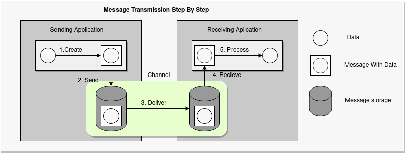

# System Integration 2020 Exam Project

## Links

- [Assignment PDF Link ](sieksamen.pdf)
- [Video Link](#href)

**Project Links**

-  [si_eksamens_registry_discovery](https://github.com/BacholarSoftwareDevelopment/si_eksamens_registry_discovery/blob/main/README.md)
-  [si_eksamens_gateway](https://github.com/BacholarSoftwareDevelopment/si_eksamens_gateway/blob/main/README.md)
-  [si_eksamens_hotels](https://github.com/BacholarSoftwareDevelopment/si_eksamens_hotels/blob/main/README.md)
-  [si_eksamens_producer](https://github.com/BacholarSoftwareDevelopment/si_eksamens_producer/blob/main/README.md)
-  [si_eksamen_consumer](https://github.com/BacholarSoftwareDevelopment/si_eksamen_consumer/blob/main/README.md)
-  [si_eksamen_frontend](https://github.com/BacholarSoftwareDevelopment/si_eksamen_Frontend/blob/main/README.md)

---

**Authors**

- Morten Feldt
- Jörg Oertel

---

**Technology used**

- Eureka
- Feign
- Ribbon
- REST
- Spring boot
- Kafka

**Business Case**  

There is a travel agency, that so far only provides an email and phone service for their customers, if they want to get in touch with them. Now they want to implement a chat  service on their website. This should help them to increase response time and customer can be reached more quickly and more efficient. Questions are categorized by topics and for a specific city 

    • Hotels
    • Tourism
    • Airport

Because of this new way of communicating with their customers, they will be more efficient in their task to provide good customer service. It also provides a more detailed information flow, because of those three topics. Not only their business can profit from it, but also the various hotels, restaurants or airports their send their customer to. [1.0 business model]
The next step would be to make deals with hotels and restaurants to get a percentage for each walk-in they get because of them.

---

<i style="font-size:15px;">This diagram shows the new intended business model of the travel agency</i>

---

**Problem Definition**  

A travel agency has contacted our IT company DevOrgs and asked us for developing a chat/messenger service for their website.  
DevOrgs has accepted the request from the travel agency and asked our team to develop this feature for their travel agency company.
The travel agency has set up the following requirements for the feature:

    1. Empty messages should not be allowed – Error message should be shown to the customer, agency.
    2. Messages should be written to only one of the following branches: Hotel, Airplane, Tourist. 
    3. Customer should beside the message provide their name, id, city and branch. 
    4. Only messages contain all information as in points 2 and 3 are allowed – otherwise an error message should be shown. 
    5. It should be possible to send messages in different formats:  XML and JSON
    6. Messages should be converted to JSON if received by the client or travel agency. 

---

<i style="font-size:15px;">This diagram shows the message flow if message is delivered successfully or an error occurred</i>

---

**Problem Solution**  

Our team solution to the project was to create various micro-services that together would be the solution of the feature.
It was build by an Eureka Discovery server, that instances of micro-services could connect to, and then with Feign each of the micro-services would be able to communicate with each-other.
An gateway was implemented as API Gateway to act as front-door for all request to the system, and then it would master the client-side load balancing by the Ribbon technology to parse the request.
The request was then entered in a Kafka message broker, where it would be translated and routed by three branches: hotel, airport, tourism.
We have implemented a REST API, where hotels are stored, and then if the branch, from above, is equal to hotel, an information about hotel from the REST API i connected to the messages. The message is also consumed by the API Gateway to retrieve messages from all branches above.

---

<i style="font-size:15px;">The diagram shows the infrastructure of the planned chat service</i>

---

**Architecture**  

Our architecture is build in that way, that we have an UI that communicate with the API Gateway.  
The gateway takes requests to the system, so we are able to either send a message or retrieve a message.  
If it's sends a message, the message would go further into Kafka message broker, that translate and route the message to the right topic.  
In the end, the message is logged in a file for later information.

---

<i style="font-size:15px;">The diagram shows the flow from the gateway to the consumer or producer</i>

---

<i style="font-size:15px;">On this diagram we wanted to show how a message travels between kafka from one application to the other </i>

---

<i style="font-size:15px;">Enterprise pattern: Content_base_router with a translator for transforming messages </i>

---
